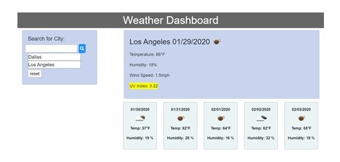

# WEATHER DASHBOARD

## INTRODUCTION
 As millions of people travel to new cities and countries, it is nice to have an app readily available to stay one step ahead of the weather.  This user friendly app allows the user to quickly access a city's current weather forecast as well as the 5 day forecast.

## FEATURES
   1. User can type any city they wish, whether it is local or global.
      * After typing in a location, the "search" button must be pushed.
     
     

   2. The following is listed for the user along with the 5 day forecast:
      * Temperature
      * Humidity
      * Wind Index
      * Uv Index
     
    

3. The user can see their past city searches in the list populated below the input box and click on them to review the weather forecast.

 

4. To clear the city list press the reset button and refresh the page.

 

### PREVIEW

 

### RESOURCES

The following websites provided coding for the various elements:

* Search Icon:

    ***Font Awesome:*** https://fontawesome.com/icons/search?style=solid

* Date Format

    ***Moments.js:***  https://momentjs.com/

* Badges for Markdown

    ***Naereen Badges:*** https://github.com/Naereen/badges

 

### BADGES
Please click the badge below to go directly to the website.

